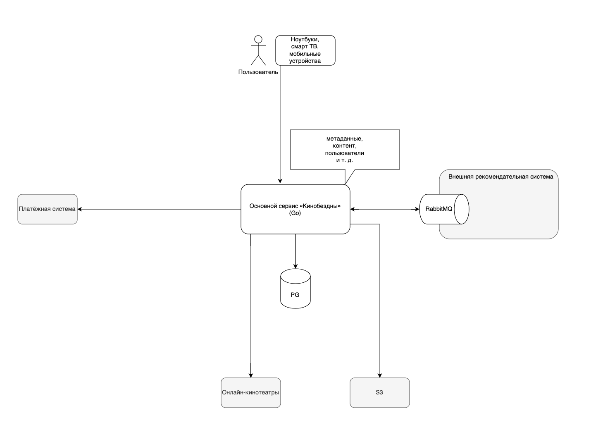
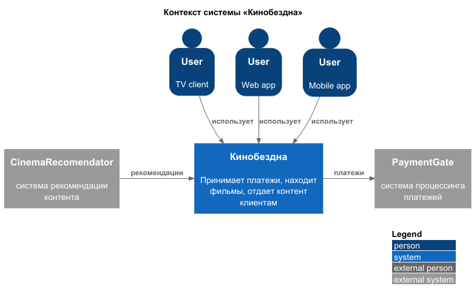
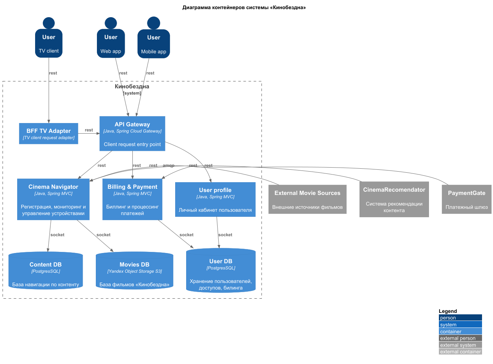

# Импакт анализ проекта «Кинобездна»

Application Change Impact Analysis

# AS-IS

**Текущее решение**

Проект «Кинобездна» превратился в крупный онлайн-кинотеатр — агрегатор. Много пользователей и различных интеграций с сервисами лояльности, маркетплейсами, платёжными системами и так далее.

- Большой и запутанный монолит на Go c СУБД PostgreSQL.
- Одна база данных.
- Сущности в базе: платежи, пользователи, видео, подписки, скидки, метаданные о фильмах (жанры, актёры, оценки).
- Все вызовы за исключением взаимодействия с рекомендательной системой сейчас происходят синхронно. Пользователь открывает сайт, аутентифицируется, выбирает фильм, может оценить фильм и составить папку с избранным.
- Сторонняя рекомендательная система делает подборку.
- API компании построено в соответствии с REST-стилем.
- Клиенты сервиса используют мобильные устройства, ноутбуки, смарт ТВ. Как следствие, на разных девайсах различаются интерфейсы и количество данных.

### Функциональность и анализ архитектуры

#### Ядро «Кинобездна»:

Главный бэкэнд сервис представляет собой монолитное Go приложение.

Система хранения структурирована на 2 источника данных
1. СУБД Postgres предназначен для хранения в единой базе
	1. пользовательских данных
	2. базы мета информации о фильмах
	3. базы для доступного контента внешних онлайн-кинотеатров
2. Yandex Object Storage S3 хранилище с базой фильмов «Кинобездна»

Ядро «Кинобездна» выполняет роли
1. Личный кабинет пользователя
2. Биллинг
3. Взаимодействие с платежным шлюзом
4. Поиск контента в общей базе фильмов
5. Навигация по внутренней базе фильмов (S3)
6. Взаимодействие с внешними кинотеатрами
7. Взаимодействие с внешней рекомендательной системой CinemaRecomendator

#### Клиентская часть:

UI пользователя представляет собой React монолит приложение, которое связывается с backend по жестко заданному адресу. Backend имеет возможность отправить сообщение по во фронтенд по Server-Sent Events (SSE).

#### Рекомендательная система:

- Реализована на базе внешний сервиса CinemaRecomendator
- Связь с сервисом построена на по шине RabbitMQ протокол AMQP 
- Когда пользователь открывает новую страницу с фильмом
	- В CinemaRecomendator EventBus уходит сообщение с ID сессии пользователя
- Когда приходит сообщение от CinemaRecomendator EventBus оно содержит
	1. ID сессии пользователя
	2. 3 рекомендованных фильма с метаинформацией и ссылкой для просмотра через ресурсы внешних кионтеатров 
* Если cессия пользователя еще активна, то рекомендации уходят в UI по SSE  

#### Платежная система система:

* Система работает в реальном времени на основе rest-запросов
* При обновлении подписок фронтенд представляет реквизиты для оплаты
* Бэкенд связывается с payment gate для проведения платежа
* Во фронтенд приходит подтверждения платежа или отказ

### Домены и границы контекстов

#### 1. User profile domain

Домен включает в себя все взаимодействие с пользователем и личным контентом пользователя.

Структурирован на поддомены
1. User credentials subdomain
2. User favorite movies subdomain
3. User seen movies archive subdomain

#### 2. Billing & Payment Domain

Домен включает в себя механизм расчета ценовых предложений клиенту, системы скидок, управления платежами и процессинга платежей.

**Ubiquitous Language домена**
- **Счет (Invoice)** - Документ с суммой к оплате
- **Платеж (Payment)** - Фактическая транзакция оплаты
- **Тарифный план (Pricing Plan)** - Правила расчета стоимости
- **Скидка (Discount)** - Уменьшение суммы к оплате
- **Возврат (Refund)** - Возврат уплаченных средств

Структурирован на
1. Billing notification subdomain
2. Bill management subdomain
3. Payment processing subdomain

Billing notification Bounded context
* Агрегаты
	* SpecialDealAggregate
	* PlannedPaymentDueAggregate
* Сервисы
	* Сервис нотификации о завершении подписок
* События
	* Скоро конец подписки
	* Ограниченная акция на подписку
* Value Objects
	* Date range

#### 3. CinemaRecomendator Domain

Домен связи межу Кинобездна и CinemaRecomendator

Структурирован на поддомены
1. CinemaRecomendator prepaid requests left tracking subdomain
2. CinemaRecomendator user data provider subdomain

#### 4. Cinema navgator core domain

Основная ценность — предоставление единого интерфейса для поиска, навигации и взаимодействия с контентом и кинотеатрами.

Структурирован на поддомены
1. Movie navigator subdomain – поиск контента по структурированной базе фильмов
2. External cinema service aggregator subdomain
3. Internal cinema provider subdomain

### Проблемы текущего решения
- Перегруженное ядро системы
	- bottleneck Movie navigator subdomain
- Жалобы на пользовательский опыт со стороны пользователей клиента для ТВ.
- Есть потребность по выстраиванию схемы персонализированных предложений, которую невозможно реализовать в рамках имеющейся архитектуры 

### Визуализация контекста системы

 * [puml контекста системы](diagrams/context/CinemaAbyss-context-general.puml)

# TO-BE
# Проект микросервисной архитектуры

## Диаграммы контейнеров (Containers)

* [puml контейнеров системы](diagrams/container/CinemaAbyss-containers-general.puml)

# API системы

### Тип API

**UI-взаимодействие и связь с платежным шлюзом** построено в REST-стиле
 - Унифицированный интерфейс со встроенной поддержкой большинства платформ разработки
 - Отсутствие состояния делает стиль устойчивым к деградации канала связи
 - Возможность управлять кэшированием запросов для оптимизации нагрузки
 - Слоистая архитектура предоставляет возможность закрыть публичный доступ к внутренним микросервиса

**Взаимодействие с рекомендательной системой CinemaRecomendator** построено на RabbitMQ, AMQP
 - Решение CinemaRecomendator

**Межконтейнерное взаимодейсвие** по Kafka native protocol
 - Pull-модель с хранением - оптимальное решение для построения хореографии между сервисами
 - Файловое хранение с ротацией подходит для логов
 - Низкие затраты на масштабирование канала с ростом роя микросервисов
